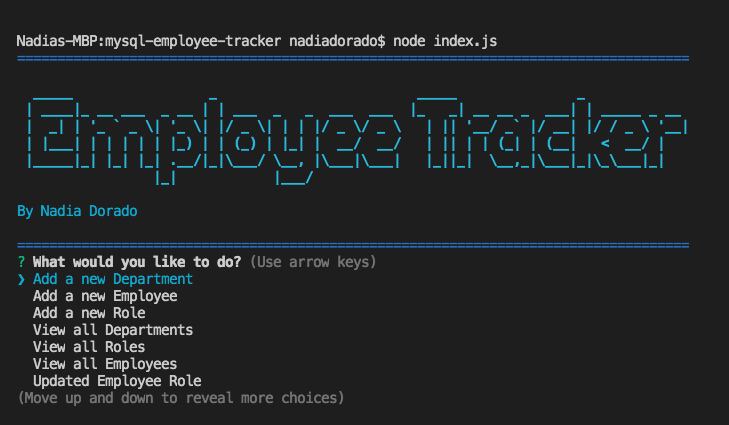
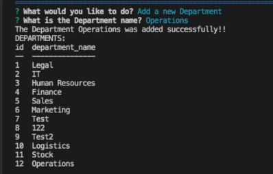
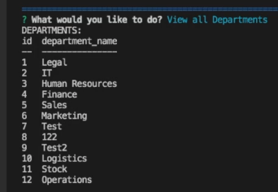
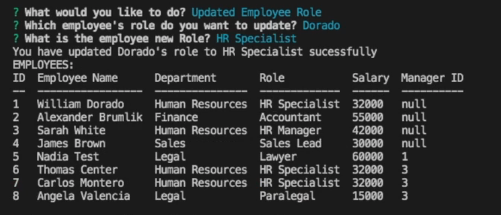

# MySQL Employee Tracker


## Description 

 This application I buildED as a solution for managing a company's employees using node, inquirer, and MySQL.

## User Story
```
As a business owner
I want to be able to view and manage the departments, roles, and employees in my company
So that I can organize and plan my business
```
 ## Table of Content  

* [Installation](#installation)

* [Technology](#technology)

* [Usage](#usage)

* [Contributions](#contributions)

* [License](#license)

* [Questions](#questions)

## Installation    

*Steps require to install this project and to get the development environment running:*

- In order to use this application, first you need to run the command below at the root of your project and answer the questions:  
```bash
npm i
```

## Technology
- JavaScript
- Node.js
- Inquirer : Use [InquirerJs](https://www.npmjs.com/package/inquirer/v/0.2.3) NPM package to interact with the user via the command-line.
- MySQL : Use the [MySQL](https://www.npmjs.com/package/mysql) NPM package to connect to your MySQL database and perform queries.
- Console.table : Use [console.table](https://www.npmjs.com/package/console.table) to print MySQL rows to the console. There is a built-in version of `console.table`, but the NPM package formats the data a little better for our purposes.

## Usage
- Link to a walkthrough video that demonstrates the application functionality:

    *  [MySQL employee Tracker  Walkthrough Video](https://vimeo.com/547024516)

### Steps to generated the application:

1. Run the following command in the terminal:
```bash
node index.js
```
2. From the menu options choose what would you like to do:
- Menu
   

3. When choosing to add a department, employee or role, please answer the questions:  
- Adding to the database: 
      

4. When you click on the View options, a table with the choosen information will be display: 
- View of the department table
     

5. To update the role of an employee, just click on the "update" option and fallow the instructions: 
- Updating an employee role
      


## Contributions

The following were contributors to this project: [Nadia Dorado](https://github.com/ndorado3)

## License
MIT

Copyright (c) [2021] [Nadia Dorado]

Permission is hereby granted, free of charge, to any person obtaining a copy of this software and associated documentation files (the "Software"), to deal in the Software without restriction, including without limitation the rights to use, copy, modify, merge, publish, distribute, sublicense, and/or sell copies of the Software, and to permit persons to whom the Software is furnished to do so, subject to the following conditions:

The above copyright notice and this permission notice shall be included in all copies or substantial portions of the Software.

THE SOFTWARE IS PROVIDED "AS IS", WITHOUT WARRANTY OF ANY KIND, EXPRESS OR IMPLIED, INCLUDING BUT NOT LIMITED TO THE WARRANTIES OF MERCHANTABILITY, FITNESS FOR A PARTICULAR PURPOSE AND NONINFRINGEMENT. IN NO EVENT SHALL THE AUTHORS OR COPYRIGHT HOLDERS BE LIABLE FOR ANY CLAIM, DAMAGES OR OTHER LIABILITY, WHETHER IN AN ACTION OF CONTRACT, TORT OR OTHERWISE, ARISING FROM, OUT OF OR IN CONNECTION WITH THE SOFTWARE OR THE USE OR OTHER DEALINGS IN THE SOFTWARE.

## Questions 
For questions about this project please contact me:  
* Email: nadiadorado@gmail.com 
* Github: (https://github.com/ndorado3) 


